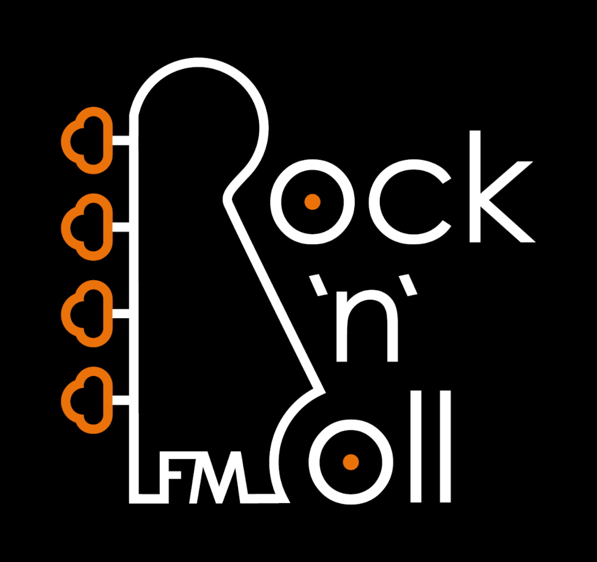

## About 📕
This is an app for radio station, that i created as a freelancer. You can listen radio, search the song in popular streaming services like Spotify and Apple Music, listen Podcasts and other small things!

## Technologies 📐
Here i used: 
- **React Native** for main developement.
- [**react-native-track-player**](https://github.com/doublesymmetry/react-native-track-player) for streaming music.
- **Node JS** and **Express** for REST API.
- Some other libraries like [react-native-vector-icons](https://github.com/oblador/react-native-vector-icons) and [react-native-slider](https://github.com/callstack/react-native-slider) for other stuff.

## Is it working? ⚙️
Yes! You can download this for:
- [IOS](https://apps.apple.com/ru/app/rocknroll-fm/id1612817086)
- [Android](https://play.google.com/store/apps/details?id=com.test_poject)

## Known issues 👾
- Player sometimes doesn't start after connection lost.

## Screenshots 🖼️

>
>
>
